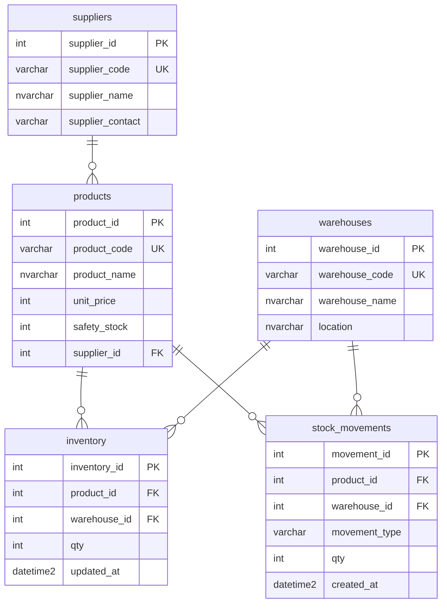

# StockFlow — 미니 ERP 재고관리

C# (.NET 8) + MS SQL Server 로 만든 재고관리 프로그램입니다.
**v1** 콘솔 메뉴, **v2** ASP.NET Core Web API + 간단한 웹 UI.
입고·출고·재고·안전재고 경고 등 **재고 도메인의 핵심 문제**에 집중했습니다.

> ORM(EF Core)을 쓰지 않고 **Dapper + 생(raw) SQL** 로 작성해, T-SQL을 직접 다룹니다.

---

## 기술 스택

| 구분 | 사용 기술 |
|------|-----------|
| 언어 | C# (.NET 8) |
| DB | Microsoft SQL Server (T-SQL) |
| DB 접근 | Dapper (Micro ORM) + Microsoft.Data.SqlClient |
| v1 UI | 콘솔 텍스트 메뉴 (`StockFlow`) |
| v2 API | ASP.NET Core Web API + Swagger (`StockFlow.Api`) |
| v2 Web | 정적 HTML (`wwwroot/index.html`) |

---

## 주요 기능

1. 상품 조회 / 등록 / 수정
2. 창고별 재고 조회 (안전재고 경고 표시)
3. 입고 처리 — 원장 기록 + 현재고 증가 (트랜잭션)
4. 출고 처리 — 원장 기록 + 현재고 차감 (**트랜잭션 + 재고부족 검증**)
5. 안전재고 미만 경고 (출고 직후 즉시 알림 / 미만 품목 목록)
6. 입출고 이력 조회 (최신순)

---

## ERD



**관계 요약**
- `suppliers` 1 : N `products` — 한 공급처가 여러 상품 공급
- `products` 1 : N `inventory`, `warehouses` 1 : N `inventory` — 상품×창고별 현재고
- `products` 1 : N `stock_movements`, `warehouses` 1 : N `stock_movements` — 상품×창고별 입출고 이력

> `inventory` 는 `(product_id, warehouse_id)` 조합에 UNIQUE 제약이 있어 "한 상품 + 한 창고 = 한 행" 을 보장합니다.

---

## 설계 포인트

- **원장(이력)과 현재고(스냅샷) 분리**
  `stock_movements` 는 입출고 사건을 append-only 로 기록(불변)하고, `inventory` 는 현재 수량만 들고 있는 스냅샷입니다. 현재고를 매번 이력 합산으로 계산하지 않아 조회가 빠릅니다.
- **트랜잭션으로 원자성 보장**
  입고/출고는 "원장 기록"과 "현재고 변경"이 한 묶음으로 처리됩니다. 하나라도 실패하면 전부 롤백되어 데이터 불일치가 발생하지 않습니다.
- **다층 방어로 음수 재고 차단**
  ① 출고 전 재고 검증(친절한 메시지) ② `CHECK (qty >= 0)` 제약(최후 안전망) 을 함께 둡니다.
- **대리키 대신 비즈니스 키로 연결**
  사용자는 코드(`PRD001`, `WH001`)로 입력하고, 내부에서 id로 변환합니다. IDENTITY 값에 의존하지 않습니다.
- **파라미터 바인딩**
  모든 입력값은 Dapper 파라미터로 전달해 SQL Injection 을 방지합니다.

---

## 프로젝트 구조

```
stockflow/
├── StockFlow.sln
├── db/
│   ├── 01_schema.sql
│   └── 02_seed.sql
├── StockFlow.Core/          # 공통 비즈니스 로직 (Dapper + SQL)
│   ├── Models/
│   ├── Dtos/
│   └── Services/
├── StockFlow/               # v1 콘솔 앱
└── StockFlow.Api/           # v2 Web API + 웹 UI
    ├── Controllers/
    └── wwwroot/index.html
```

---

## 실행 방법

### 1. 사전 준비
- .NET 8 SDK
- SQL Server (Express 이상) + SSMS

### 2. 데이터베이스 생성
SSMS에서 아래 순서로 실행합니다.
```
db/01_schema.sql   → 데이터베이스(StockFlow)와 테이블 생성
db/02_seed.sql     → 테스트 데이터 입력
```

### 3. 접속 문자열 확인
`StockFlow/Program.cs` 상단의 접속 문자열을 본인 환경에 맞게 수정합니다.
```csharp
const string connectionString =
    @"Server=.\SQLEXPRESS;Database=StockFlow;Trusted_Connection=True;TrustServerCertificate=True;";
```
> `Server` 값은 SSMS 로그인 시 "서버 이름" 과 동일하게 설정합니다.

### 4. 실행 (v1 콘솔)
```bash
cd StockFlow
dotnet run
```

### 5. 실행 (v2 API + 웹)
```bash
cd StockFlow.Api
dotnet run
```
- 브라우저: `https://localhost:7xxx/` (재고 현황 웹 UI)
- Swagger: `https://localhost:7xxx/swagger` (API 문서/테스트)

**주요 API**
| Method | URL | 설명 |
|--------|-----|------|
| GET | `/api/products` | 상품 목록 |
| GET | `/api/inventory` | 창고별 재고 |
| GET | `/api/inventory/low-stock` | 안전재고 미만 |
| GET | `/api/stock/movements` | 입출고 이력 |
| POST | `/api/stock/receive` | 입고 |
| POST | `/api/stock/issue` | 출고 |

---

## 향후 개선 (v3)

- 콘솔 앱도 `StockFlow.Core` 공유하도록 리팩터링
- 공급처/창고 CRUD API
- 출고와 주문(orders) 연동 (`stock_movements` reference 컬럼)
- 기간별 입출고 리포트
